# App

_Auto-generated feature documentation for `app/`._

## Endpoints

### GET /

Handles `GET /`.

### POST /chat

Facilitates the exchange of messages between users in a conversation.

### GET /config

Retrieves the currently active and resolved configuration for the application or a specific component.

### POST /feedback

Allows users to submit their feedback to the application.

### GET /health

It verifies the application's operational status and availability.

### POST /health/neo4j

This endpoint sends a keepalive signal to the Neo4j database to confirm its availability and maintain an active connection.

### POST /ingest

This endpoint initiates the data ingestion process.

## Functions

### `InMemoryRateLimiter.is_rate_limited`

This function determines if a request has surpassed its allowed frequency within a timeframe, based on in-memory records.

### `RetrievedChunk.snippet`

It returns a concise, representative text excerpt from a retrieved chunk of information.

### `Settings.frontend_origins`

It specifies the allowed web origins (domains/URLs) from which frontend applications can connect to the backend.

### `Settings.validate_keepalive_token`

This function verifies the validity of a token used to maintain an active user session.

### `SimpleLRUCache.get`

Retrieves an item from the cache, marking it as recently used if found.

### `SimpleLRUCache.set`

Adds or updates a key-value pair in the cache, making it the most recently used and potentially evicting the least recently used item if the cache is full.

### `chunk_text`

Breaks down a large text into smaller, more manageable segments or "chunks."

### `client_ip_from_request`

This function extracts the client's IP address from an incoming request.

### `close_driver`

This function shuts down a driver, ending its connection and releasing associated resources.

### `embed_text`

It converts text into a numerical representation that captures its semantic meaning.

### `end_span`

It marks the completion of a tracked operation or time segment.

### `flush_langfuse`

Forces all buffered Langfuse observability and tracing data to be sent to the Langfuse platform immediately.

### `generate_answer`

It creates a relevant response to a given query or input.

### `generate_answer_stream`

`generate_answer_stream()` — see source for details.

### `get_client`

`get_client()` — see source for details.

### `get_driver`

Retrieves a configured driver instance.

### `get_prompt`

`get_prompt()` — see source for details.

### `get_settings`

`get_settings()` — see source for details.

### `ingest_content`

`ingest_content()` — see source for details.

### `init_langfuse`

`init_langfuse()` — see source for details.

### `is_portfolio_question`

`is_portfolio_question()` — see source for details.

### `langfuse_enabled`

`langfuse_enabled()` — see source for details.

### `lifespan`

`lifespan()` — see source for details.

### `llm_metadata`

`llm_metadata()` — see source for details.

### `mask_pii`

`mask_pii()` — see source for details.

### `score_feedback`

`score_feedback()` — see source for details.

### `search_chunks`

`search_chunks()` — see source for details.

### `seed_prompts`

`seed_prompts()` — see source for details.

### `start_span`

`start_span()` — see source for details.

### `start_trace`

`start_trace()` — see source for details.

### `update_trace`

`update_trace()` — see source for details.

## Key internals

- `_build_messages` — called by the public surface.
- `_cache_key` — called by the public surface.
- `_chunk_id` — called by the public surface.
- `_condense_question` — called by the public surface.
- `_ensure_gemini_key` — called by the public surface.
- `_hard_split` — called by the public surface.
- `_keyword_accept` — called by the public surface.
- `_read_documents` — called by the public surface.
- `_redact` — called by the public surface.
- `_require_admin` — called by the public surface.
- `_require_env` — called by the public surface.
- `_sources_from_chunks` — called by the public surface.
- `_split_sections` — called by the public surface.
- `_startup_ingest` — called by the public surface.
- `_stream_completion` — called by the public surface.

## Diagrams

### GET /

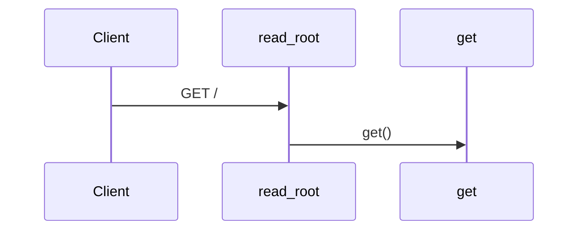

### POST /feedback

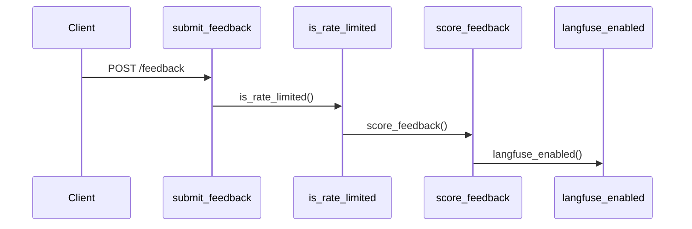

### GET /health

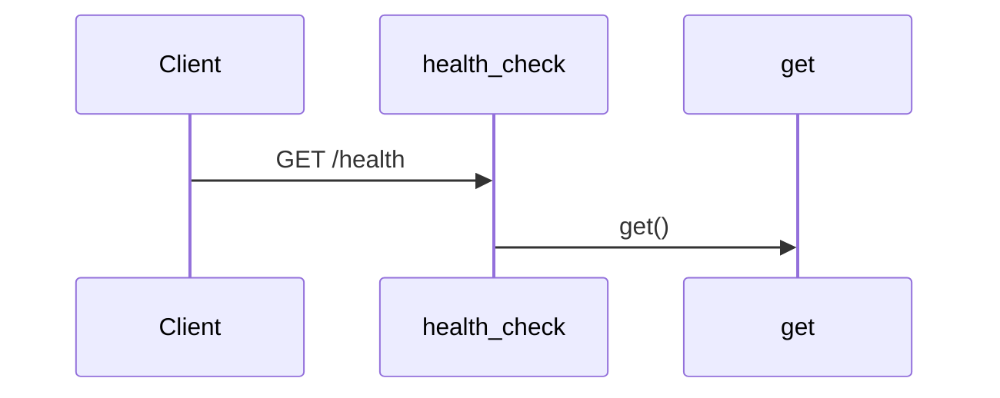

### POST /health/neo4j

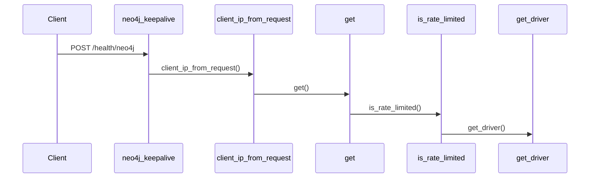

### POST /chat

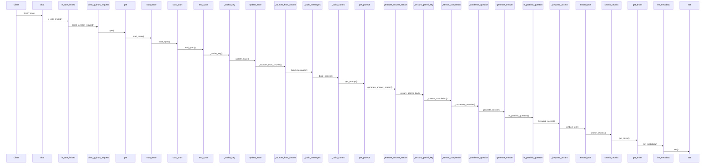

### GET /config

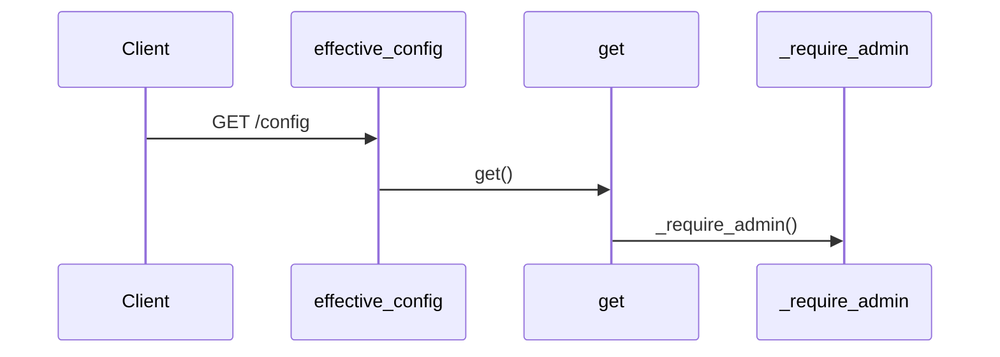

### POST /ingest

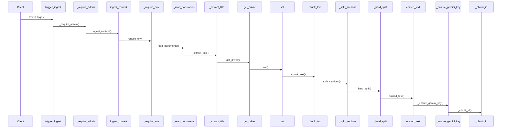

### client_ip_from_request()

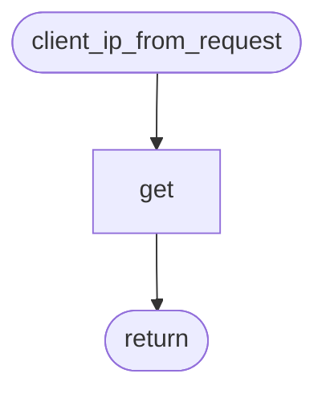

### _read_documents()

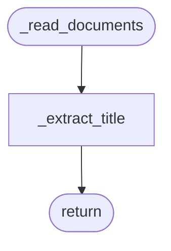

### ingest_content()

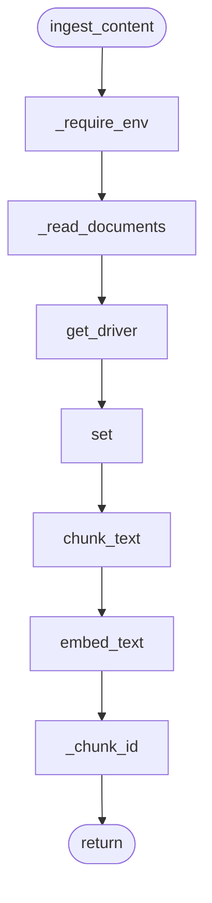

### search_chunks()

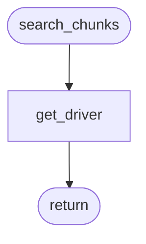

### is_portfolio_question()

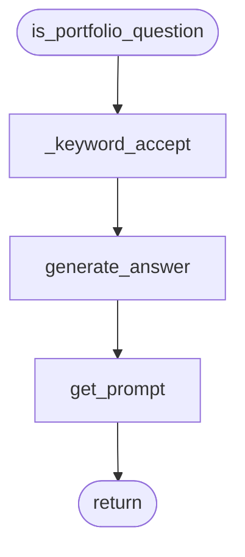

### generate_answer()


### _stream_completion()

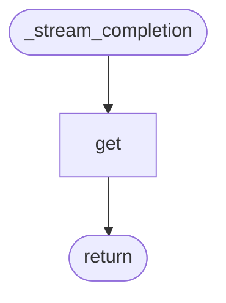

### generate_answer_stream()

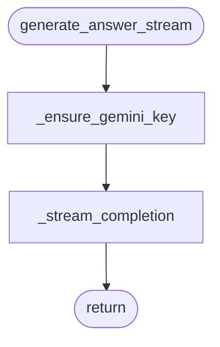

### chunk_text()

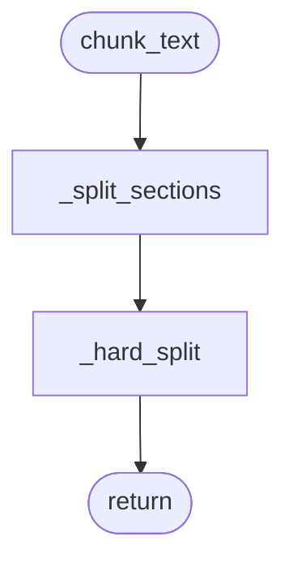

### mask_pii()


### init_langfuse()


### get_prompt()


### seed_prompts()


### _condense_question()

```mermaid
flowchart TD
    start([_condense_question])
    n0_get_prompt[get_prompt]
    start --> n0_get_prompt
    n1_generate_answer[generate_answer]
    n0_get_prompt --> n1_generate_answer
    n1_generate_answer --> done([return])
```
