# App

_Auto-generated feature documentation for `app/`._

## Endpoints

### GET /

The "read_root" App endpoint retrieves the root-level data or configuration.

### POST /chat

The "chat" app endpoint facilitates real-time text-based communication between users.

### GET /config

The "effective_config" app endpoint retrieves and returns the current configuration settings that are in effect for an application or system.

### POST /feedback

The "submit_feedback" app endpoint allows users to send feedback for improvement or reporting issues.

### GET /health

The "health_check" app endpoint is used to verify the operational status of the application or service it belongs to.

### POST /health/neo4j

The `neo4j_keepalive` app endpoint is designed to maintain and verify the active connection between a client and a Neo4j database server by sending periodic keep-alive signals.

### POST /ingest

The `trigger_ingest` app endpoint is designed to initiate data ingestion processes.

## Functions

### `InMemoryRateLimiter.is_rate_limited`

The `is_rate_limited` function checks if an action should be rate-limited based on in-memory counters and timestamps.

### `RetrievedChunk.snippet`

RetrievedChunk.snippet is a function that extracts and returns a specific segment or "chunk" of text from a larger body of text, often used for previewing or displaying parts of documents or content.

### `Settings.frontend_origins`

This App function manages and configures allowed frontend origins for security settings.

### `Settings.validate_keepalive_token`

The Settings.validate_keepalive_token function checks if the keep-alive token is valid and updates its expiration time accordingly.

### `SimpleLRUCache.get`

The `SimpleLRUCache.get` function retrieves an item from the cache using its key, updating the cache's order to maintain the most recently used items at the front.

### `SimpleLRUCache.set`

The `SimpleLRUCache.set` function adds or updates an entry in the cache using the specified key and value, adhering to the Least Recently Used (LRU) eviction policy.

### `chunk_text`

The chunk_text function splits text into smaller segments or chunks based on specified parameters such as character count or number of words.

### `client_ip_from_request`

The `client_ip_from_request` function extracts and returns the IP address of the client making the request.

### `close_driver`

The `close_driver` function terminates or stops a driver process.

### `embed_text`

The "embed_text" app function converts text into numerical vectors that represent its meaning for tasks like search and recommendation.

### `end_span`

The "end_span" function marks the conclusion of a span or segment in a process or data flow.

### `flush_langfuse`

The `flush_langfuse` app function is designed to clear or reset the Langfuse database, ensuring that all data is removed and starting fresh.

### `generate_answer`

The "generate_answer" app function creates responses to user queries or prompts based on its programmed algorithms and data.

### `generate_answer_stream`

The `generate_answer_stream` function generates a stream of answers to a given question or prompt in real-time.

### `get_client`

The `get_client` function retrieves a client object for making API requests.

### `get_driver`

The `get_driver` function retrieves a database driver based on specified connection details.

### `get_prompt`

The `get_prompt` function retrieves and returns a prompt based on specified criteria or parameters.

### `get_settings`

The `get_settings` function retrieves user preferences or application configuration settings.

### `ingest_content`

The ingest_content app function processes and imports new data into a system for further analysis or storage.

### `init_langfuse`

The `init_langfuse` function initializes the Langfuse library for language model evaluation and monitoring.

### `is_portfolio_question`

The `is_portfolio_question` function checks if a given question is related to a portfolio.

### `langfuse_enabled`

The `langfuse_enabled` function checks if language fusion is enabled in the system.

### `lifespan`

The Lifespan app tracks and monitors an individual's health metrics to predict and manage their longevity.

### `llm_metadata`

The llm_metadata app function retrieves and displays metadata related to language models.

### `mask_pii`

The `mask_pii` app function masks personally identifiable information (PII) in data to protect user privacy.

### `score_feedback`

The `score_feedback` app function evaluates and assigns scores to user feedback based on predefined criteria or algorithms.

### `search_chunks`

The "search_chunks" app function searches for specific data within pre-defined chunks of information.

### `seed_prompts`

The seed_prompts app generates and curates initial prompts for creative writing or content creation tasks.

### `start_span`

The `start_span` function initializes and starts a new tracing span in an application's execution flow.

### `start_trace`

The "start_trace" function initiates a performance tracing session to monitor and analyze application behavior.

### `update_trace`

The "update_trace" app function updates and tracks user activity logs in real-time.

## Key internals

- `_build_messages` — called by the public surface.
- `_cache_key` — called by the public surface.
- `_chunk_id` — called by the public surface.
- `_condense_question` — called by the public surface.
- `_ensure_gemini_key` — called by the public surface.
- `_hard_split` — called by the public surface.
- `_keyword_accept` — called by the public surface.
- `_read_documents` — called by the public surface.
- `_redact` — called by the public surface.
- `_require_admin` — called by the public surface.
- `_require_env` — called by the public surface.
- `_sources_from_chunks` — called by the public surface.
- `_split_sections` — called by the public surface.
- `_startup_ingest` — called by the public surface.
- `_stream_completion` — called by the public surface.

## Diagrams

### GET /

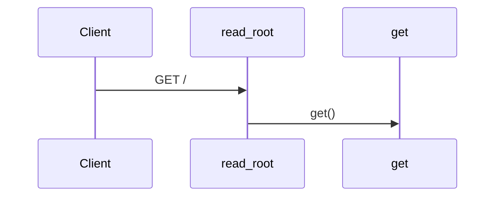

### GET /health

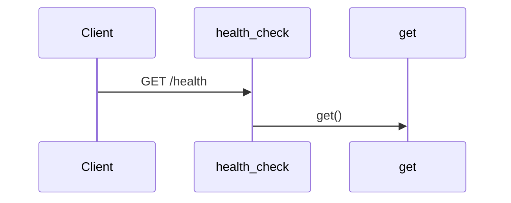

### POST /health/neo4j

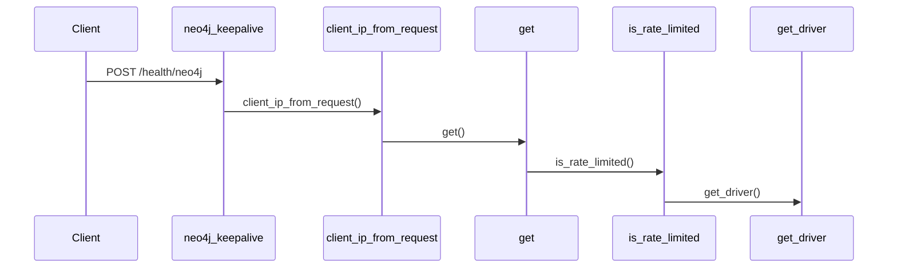

### POST /feedback

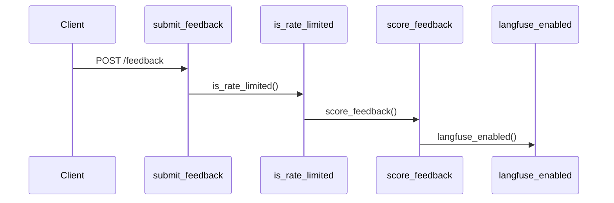

### POST /chat

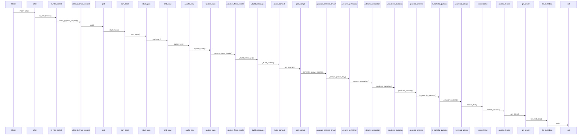

### GET /config

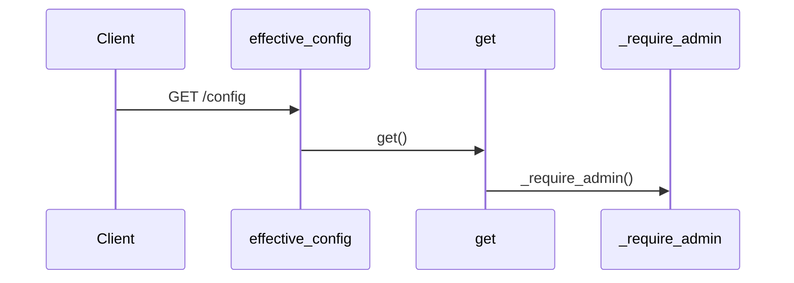

### POST /ingest

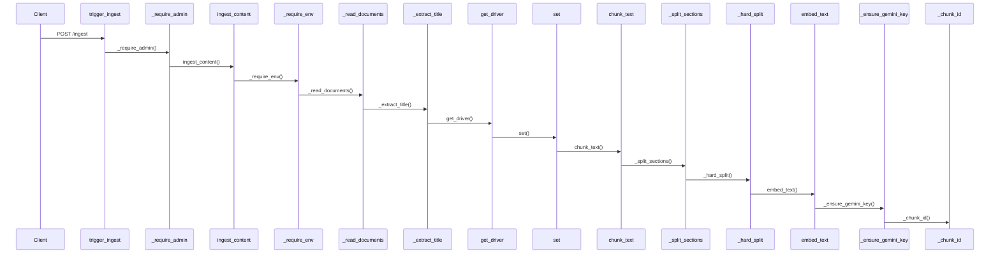

### client_ip_from_request()


### _read_documents()


### ingest_content()


### chunk_text()


### generate_answer()

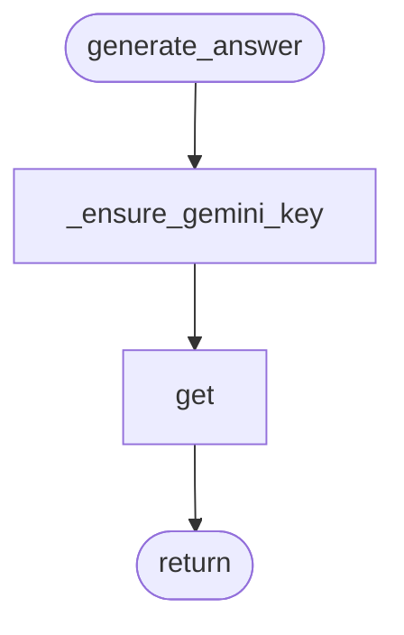

### _stream_completion()

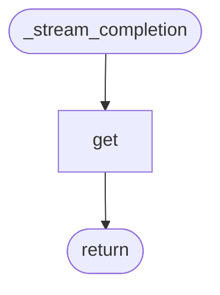

### generate_answer_stream()

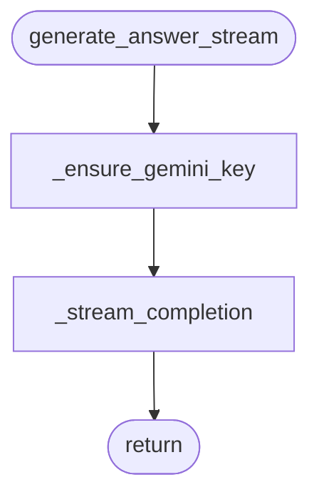

### mask_pii()

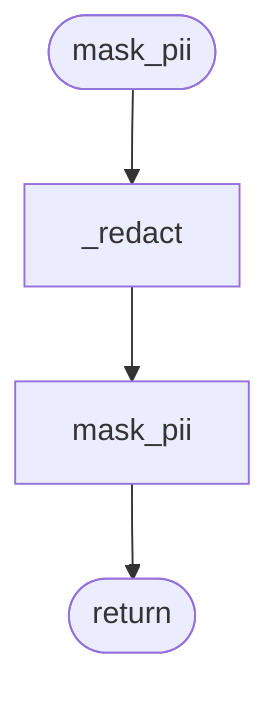

### init_langfuse()

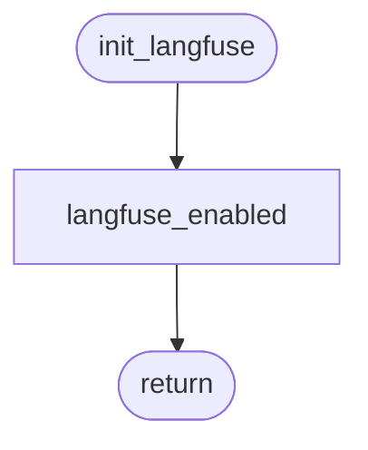

### get_prompt()

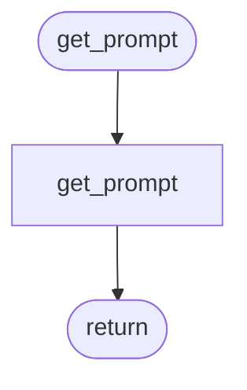

### seed_prompts()

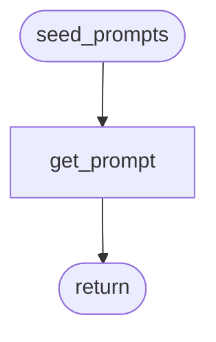

### is_portfolio_question()


### search_chunks()


### _condense_question()

```mermaid
flowchart TD
    start([_condense_question])
    n0_get_prompt[get_prompt]
    start --> n0_get_prompt
    n1_generate_answer[generate_answer]
    n0_get_prompt --> n1_generate_answer
    n1_generate_answer --> done([return])
```
