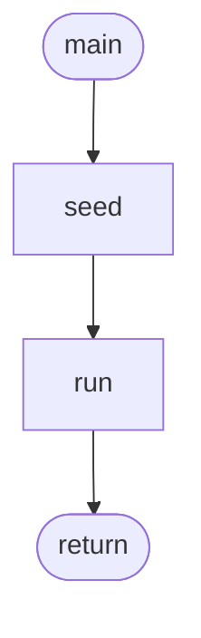
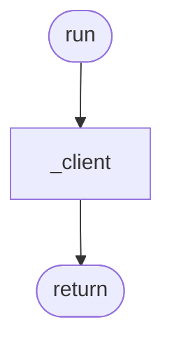

# Evals

_Auto-generated feature documentation for `evals/`._

## Functions

### `main`

The `main` function is the entry point of a program, executing the primary logic and operations when the program runs.

### `run`

The `run` function executes and evaluates a given script or command within a specified environment.

### `seed`

The `seed` function initializes a random number generator with a specified seed value to produce reproducible sequences of pseudo-random numbers.

### `sweep`

The `sweep` function evaluates and processes data across multiple iterations or conditions to produce a result.

## Key internals

- `_client` — called by the public surface.

## Diagrams

### main()

### run()

